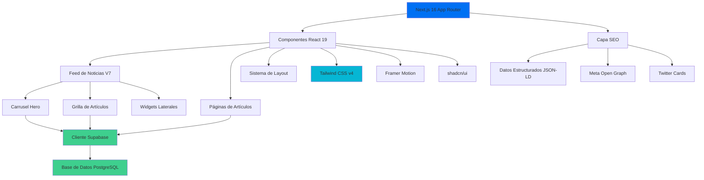

[English](./README.md) | [Español](./README.es.md) | [Português](./README.pt.md)

# Venezuela News App

Plataforma de agregación de noticias en tiempo real construida con Next.js 16, con curación de contenido impulsada por IA, optimización SEO y un sistema de diseño glassmorphism moderno.

## Descripción General

Esta aplicación funciona como un portal de noticias integral enfocado en eventos actuales de Venezuela. Combina tecnologías web modernas con un diseño UX cuidadoso para ofrecer una experiencia de lectura rápida, accesible y visualmente atractiva.

La plataforma implementa un sistema sofisticado de entrega de contenido con actualizaciones en tiempo real desde Supabase, optimización SEO automática para cumplir con Google News, y un diseño responsivo que se adapta perfectamente desde dispositivos móviles (375px) hasta escritorio (1440px+).

Construida con el App Router de Next.js 16 y Turbopack, la aplicación prioriza el rendimiento sin sacrificar la calidad visual. El sistema de diseño glassmorphism proporciona una estética contemporánea mientras mantiene los estándares de accesibilidad WCAG 2.1 AA.

## Arquitectura



## Características

### Entrega de Contenido

- **Actualizaciones en Tiempo Real**: Feed de noticias en vivo con suscripciones de Supabase
- **Carrusel Hero**: Historias destacadas con rotación automática y controles manuales (intervalo 5s)
- **Paginación Inteligente**: Carga progresiva (6 → 12 → 18 artículos)
- **Páginas de Detalle**: Vistas de contenido completo con historias relacionadas

### Sistema de Diseño

- **Glassmorphism 2.0**: UI translúcida moderna con efectos de desenfoque
- **Modo Oscuro**: Cambio de tema consciente del sistema con override manual
- **Layout Responsivo**: Diseño mobile-first (375px a 1440px+)
- **Accesibilidad**: Cumple con WCAG 2.1 AA con navegación por teclado

### SEO y Rendimiento

- **Datos Estructurados**: JSON-LD completo de NewsArticle para Google News
- **Meta Tags**: Optimización de Open Graph y Twitter Card
- **Optimización de Imágenes**: Conversión automática a WebP y lazy loading
- **Code Splitting**: División automática basada en rutas
- **Generación Estática**: Páginas pre-renderizadas para rendimiento óptimo

## Stack Tecnológico


**Core**:

- [Next.js 16](https://nextjs.org/) - Framework React con App Router
- [TypeScript](https://www.typescriptlang.org/) - Desarrollo type-safe
- [React 19](https://react.dev/) - Biblioteca de componentes UI

**Estilos**:

- [Tailwind CSS v4](https://tailwindcss.com/) - Framework CSS utility-first
- [shadcn/ui](https://ui.shadcn.com/) - Primitivas de componentes accesibles
- [Framer Motion](https://www.framer.com/motion/) - Biblioteca de animaciones
- [Lucide React](https://lucide.dev/) - Sistema de iconos

**Backend**:

- [Supabase](https://supabase.com/) - Base de datos PostgreSQL con suscripciones en tiempo real

**Despliegue**:

- [Vercel](https://vercel.com/) - Despliegue en red edge

## Primeros Pasos

### Prerequisitos

- Node.js 18 o superior
- Gestor de paquetes npm o pnpm
- Cuenta de Supabase (tier gratuito disponible)

### Instalación

1. **Clonar el repositorio**:

```bash
git clone https://github.com/LuisSambrano/venezuela-news-app.git
cd venezuela-news-app
```

2. **Instalar dependencias**:

```bash
npm install
# o
pnpm install
```

3. **Configurar variables de entorno**:

Crear un archivo `.env.local` en el directorio raíz:

```env
NEXT_PUBLIC_SUPABASE_URL=url_de_tu_proyecto_supabase
NEXT_PUBLIC_SUPABASE_ANON_KEY=clave_anon_de_supabase
```

Puedes encontrar estos valores en la configuración de tu proyecto Supabase bajo API.

4. **Ejecutar el servidor de desarrollo**:

```bash
npm run dev
# o
pnpm dev
```

5. **Abrir la aplicación**:

Navega a [http://localhost:3000](http://localhost:3000) en tu navegador.

### Comandos de Desarrollo

```bash
npm run dev          # Iniciar servidor de desarrollo con Turbopack
npm run build        # Construir para producción
npm run start        # Iniciar servidor de producción
npm run lint         # Ejecutar verificaciones ESLint
```

## Estructura del Proyecto

```
src/
├── app/                    # Next.js App Router
│   ├── (routes)/          # Grupos de rutas
│   │   ├── articulo/      # Páginas de detalle de artículos
│   │   └── page.tsx       # Página de inicio
│   ├── api/               # Rutas API
│   ├── layout.tsx         # Layout raíz con providers
│   └── globals.css        # Estilos globales
├── components/            # Componentes React
│   ├── home/             # Componentes de página de inicio
│   │   ├── HeroCarousel.tsx
│   │   └── NewsFeed.tsx
│   ├── news/             # Componentes específicos de noticias
│   │   ├── ArticleCard.tsx
│   │   └── ArticleDetail.tsx
│   ├── layout/           # Componentes de layout
│   │   ├── Header.tsx
│   │   └── Footer.tsx
│   └── ui/               # Primitivas shadcn/ui
├── lib/                  # Utilidades y configuraciones
│   ├── api/             # Funciones cliente API
│   ├── utils/           # Funciones auxiliares
│   └── constants/       # Constantes de aplicación
└── types/               # Definiciones de tipos TypeScript
```

## Configuración

### Variables de Entorno

| Variable                        | Descripción               | Requerida |
| ------------------------------- | ------------------------- | --------- |
| `NEXT_PUBLIC_SUPABASE_URL`      | URL del proyecto Supabase | Sí        |
| `NEXT_PUBLIC_SUPABASE_ANON_KEY` | Clave anónima de Supabase | Sí        |

### Esquema de Base de Datos

La aplicación espera la siguiente estructura de tabla en Supabase:

```sql
-- Tabla de artículos
create table articles (
  id uuid primary key default uuid_generate_v4(),
  title text not null,
  content text not null,
  excerpt text,
  image_url text,
  published_at timestamp with time zone,
  author text,
  category text,
  created_at timestamp with time zone default now()
);
```

## Contribuir

Las contribuciones son bienvenidas. Por favor sigue estas pautas:

1. Haz fork del repositorio
2. Crea una rama de feature: `git checkout -b feature/descripcion`
3. Realiza tus cambios con commits claros y atómicos
4. Push a tu fork: `git push origin feature/descripcion`
5. Envía un pull request con una descripción detallada

### Convención de Commits

Este proyecto sigue [Conventional Commits](https://www.conventionalcommits.org/):

- `feat`: Nueva característica
- `fix`: Corrección de bug
- `refactor`: Refactorización de código
- `style`: Cambios de estilo de código (formato, etc.)
- `docs`: Actualizaciones de documentación
- `test`: Adiciones o modificaciones de tests
- `chore`: Tareas de mantenimiento

Ejemplo: `feat(news-feed): agregar paginación de scroll infinito`

## Licencia

Licencia MIT - Ver [LICENSE](LICENSE) para detalles.

## Enlaces

- **Repositorio**: [github.com/LuisSambrano/venezuela-news-app](https://github.com/LuisSambrano/venezuela-news-app)
- **Autor**: [Luis Sambrano](https://github.com/LuisSambrano)
- **Documentación**: [docs/](./docs)

---

[English](./README.md) | **Español**
