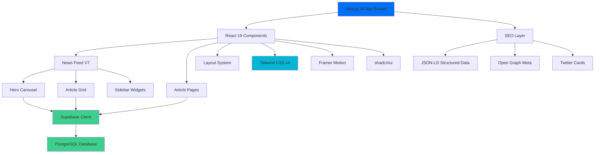

[English](./README.md) | [Español](./README.es.md)

# Venezuela News App

A real-time news aggregation platform built with Next.js 16, featuring AI-powered content curation, SEO optimization, and a modern glassmorphism design system.

<!-- CTAs -->
<p align="center">
  <a href="https://github.com/LuisSambrano/venezuela-news-app/stargazers"></a>
  <a href="https://github.com/LuisSambrano/venezuela-news-app/network/members"></a>
  <a href="https://github.com/LuisSambrano/venezuela-news-app/issues"></a>
  <a href="https://github.com/LuisSambrano/venezuela-news-app/blob/main/LICENSE"></a>
</p>

## Overview

This application serves as a comprehensive news portal focused on Venezuelan current events. It combines modern web technologies with thoughtful UX design to deliver a fast, accessible, and visually engaging reading experience.

The platform implements a sophisticated content delivery system with real-time updates from Supabase, automatic SEO optimization for Google News compliance, and a responsive design that adapts seamlessly across devices from mobile (375px) to desktop (1440px+).

Built with Next.js 16's App Router and Turbopack, the application prioritizes performance without sacrificing visual quality. The glassmorphism design system provides a contemporary aesthetic while maintaining WCAG 2.1 AA accessibility standards.

## Architecture



## Features

### Content Delivery

- **Real-time Updates**: Live news feed powered by Supabase subscriptions
- **Hero Carousel**: Auto-rotating featured stories with manual controls (5s interval)
- **Smart Pagination**: Progressive loading (6 → 12 → 18 articles)
- **Article Detail Pages**: Full-content views with related stories

### Design System

- **Glassmorphism 2.0**: Modern translucent UI with backdrop blur effects
- **Dark Mode**: System-aware theme switching with manual override
- **Responsive Layout**: Mobile-first design (375px to 1440px+)
- **Accessibility**: WCAG 2.1 AA compliant with keyboard navigation

### SEO & Performance

- **Structured Data**: Complete NewsArticle JSON-LD for Google News
- **Meta Tags**: Open Graph and Twitter Card optimization
- **Image Optimization**: Automatic WebP conversion and lazy loading
- **Code Splitting**: Route-based automatic splitting
- **Static Generation**: Pre-rendered pages for optimal performance

## Tech Stack


**Core**:

- [Next.js 16](https://nextjs.org/) - React framework with App Router
- [TypeScript](https://www.typescriptlang.org/) - Type-safe development
- [React 19](https://react.dev/) - UI component library

**Styling**:

- [Tailwind CSS v4](https://tailwindcss.com/) - Utility-first CSS framework
- [shadcn/ui](https://ui.shadcn.com/) - Accessible component primitives
- [Framer Motion](https://www.framer.com/motion/) - Animation library
- [Lucide React](https://lucide.dev/) - Icon system

**Backend**:

- [Supabase](https://supabase.com/) - PostgreSQL database with real-time subscriptions

**Deployment**:

- [Vercel](https://vercel.com/) - Edge network deployment

## Getting Started

### Prerequisites

- Node.js 18 or higher
- npm or pnpm package manager
- Supabase account (free tier available)

### Installation

1. **Clone the repository**:

```bash
git clone https://github.com/LuisSambrano/venezuela-news-app.git
cd venezuela-news-app
```

2. **Install dependencies**:

```bash
npm install
# or
pnpm install
```

3. **Configure environment variables**:

Create a `.env.local` file in the root directory:

```env
NEXT_PUBLIC_SUPABASE_URL=your_supabase_project_url
NEXT_PUBLIC_SUPABASE_ANON_KEY=your_supabase_anon_key
```

You can find these values in your Supabase project settings under API.

4. **Run the development server**:

```bash
npm run dev
# or
pnpm dev
```

5. **Open the application**:

Navigate to [http://localhost:3000](http://localhost:3000) in your browser.

### Development Commands

```bash
npm run dev          # Start development server with Turbopack
npm run build        # Build for production
npm run start        # Start production server
npm run lint         # Run ESLint checks
```

## Project Structure

```
src/
├── app/                    # Next.js App Router
│   ├── (routes)/          # Route groups
│   │   ├── articulo/      # Article detail pages
│   │   └── page.tsx       # Landing page
│   ├── api/               # API routes
│   ├── layout.tsx         # Root layout with providers
│   └── globals.css        # Global styles
├── components/            # React components
│   ├── home/             # Landing page components
│   │   ├── HeroCarousel.tsx
│   │   └── NewsFeed.tsx
│   ├── news/             # News-specific components
│   │   ├── ArticleCard.tsx
│   │   └── ArticleDetail.tsx
│   ├── layout/           # Layout components
│   │   ├── Header.tsx
│   │   └── Footer.tsx
│   └── ui/               # shadcn/ui primitives
├── lib/                  # Utilities and configurations
│   ├── api/             # API client functions
│   ├── utils/           # Helper functions
│   └── constants/       # Application constants
└── types/               # TypeScript type definitions
```

## Configuration

### Environment Variables

| Variable                        | Description            | Required |
| ------------------------------- | ---------------------- | -------- |
| `NEXT_PUBLIC_SUPABASE_URL`      | Supabase project URL   | Yes      |
| `NEXT_PUBLIC_SUPABASE_ANON_KEY` | Supabase anonymous key | Yes      |

### Database Schema

The application expects the following Supabase table structure:

```sql
-- Articles table
create table articles (
  id uuid primary key default uuid_generate_v4(),
  title text not null,
  content text not null,
  excerpt text,
  image_url text,
  published_at timestamp with time zone,
  author text,
  category text,
  created_at timestamp with time zone default now()
);
```

## Contributing

Contributions are welcome. Please follow these guidelines:

1. Fork the repository
2. Create a feature branch: `git checkout -b feature/description`
3. Make your changes with clear, atomic commits
4. Push to your fork: `git push origin feature/description`
5. Submit a pull request with a detailed description

### Commit Convention

This project follows [Conventional Commits](https://www.conventionalcommits.org/):

- `feat`: New feature
- `fix`: Bug fix
- `refactor`: Code refactoring
- `style`: Code style changes (formatting, etc.)
- `docs`: Documentation updates
- `test`: Test additions or modifications
- `chore`: Maintenance tasks

Example: `feat(news-feed): add infinite scroll pagination`

## License

MIT License - See [LICENSE](LICENSE) for details.

## Links

- **Repository**: [github.com/LuisSambrano/venezuela-news-app](https://github.com/LuisSambrano/venezuela-news-app)
- **Author**: [Luis Sambrano](https://github.com/LuisSambrano)
- **Documentation**: [docs/](./docs)

---

**[Español](./README.es.md)** | English
